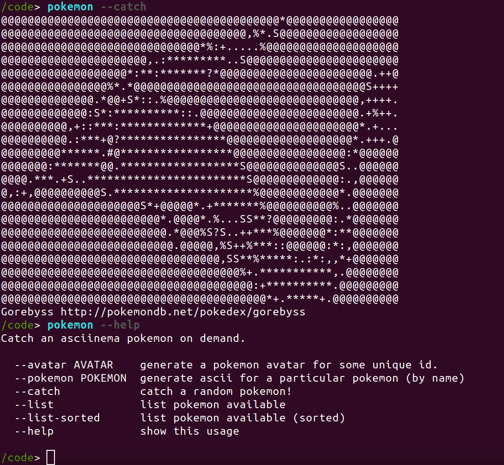

# Nushell Plugin in Python



This is an example implementation of a Pokemon plugin for Nushell in Python.
I wanted to create this to clearly lay out how someone should provide named
arguments.


```
/code> pokemon --mandatory MANDATORYARG
/code> cat /tmp/nu_plugin_pokemon.log
root - INFO - REQUEST {"jsonrpc":"2.0","method":"sink","params":[{"args":{"positional":null,"named":{"mandatory":{"tag":{"anchor":null,"span":{"start":20,"end":32}},"item":{"Primitive":{"String":"MANDATORYARG"}}}}},"name_tag":{"anchor":null,"span":{"start":0,"end":7}}},[]]}

root - INFO - METHOD sink
/code> pokemon --mandatory MANDATORYARG --optional OPTIONALARG --switch
/code> cat /tmp/nu_plugin_pokemon.log
root - INFO - REQUEST {"jsonrpc":"2.0","method":"sink","params":[{"args":{"positional":null,"named":{"switch":{"tag":{"anchor":null,"span":{"start":58,"end":64}},"item":{"Primitive":{"Boolean":true}}},"mandatory":{"tag":{"anchor":null,"span":{"start":20,"end":32}},"item":{"Primitive":{"String":"MANDATORYARG"}}},"optional":{"tag":{"anchor":null,"span":{"start":44,"end":55}},"item":{"Primitive":{"String":"OPTIONALARG"}}}}},"name_tag":{"anchor":null,"span":{"start":0,"end":7}}},[]]}

```

## Build

You can optionally build the container:

```bash
$ docker build -t vanessa/nu-plugin-pokemon .
```

If you don't, it's available on Docker Hub and will be pulled automatically.

## Usage

Run the container to access the nu entrypoint!

```bash
$ docker run -it vanessa/nu-plugin-pokemon
```

Once inside you can ask for help for the plugin:

```bash
/code> help pokemon
Catch an asciinema pokemon on demand.

  --avatar AVATAR    generate a pokemon avatar for some unique id.
  --pokemon POKEMON  generate ascii for a particular pokemon (by name)
  --catch            catch a random pokemon!
  --list             list pokemon available
  --list-sorted      list pokemon available (sorted)
  --help             show this usage


Usage:
  > pokemon {flags} 

flags:
  --avatar <String>
  --pokemon <String>
  --catch
  --help
  --list-sorted
```

I also implemented the (more expected) --help command, which looks cleaner too:

```
/code> pokemon --help
Catch an asciinema pokemon on demand.

  --avatar AVATAR    generate a pokemon avatar for some unique id.
  --pokemon POKEMON  generate ascii for a particular pokemon (by name)
  --catch            catch a random pokemon!
  --list             list pokemon available
  --list-sorted      list pokemon available (sorted)
  --help             show this usage
```

### Catch A Pokemon

To catch a random pokemon, use the --catch flag.

```bash
/code> pokemon --catch
@@@@@@@@@@@@@@@@@@@@@@@@@@@@@@@@@@@@@@@@@@@@@@@,@@@@@@@@@@@@
@@@@@@@@@@@@@@@@@@@@@@@@@@@@@@@@@@@@@@@@@@@@+,.,@@@@@@@@@@@@
@@@@@@@@@@@@@@@@@@@@@@@@@@@@@@@@@@@@@@@@@@,::.:@@@@@@@@@@@@@
@@@@@@@@@@@@@@@@@@@@@@@@@@@@@@@@@@@@@@@@.,,:*.@@@@@@@@@@@@@@
@@@@@@@@@@@@@@@@@@@@@@@@@@@@@@@@@@@@@@@,,,:**S@@@@@@@@@@@@@@
@@@@@@@@@@@@@@@@@@@@@@@@@@@@@@@@@@@@@@*,,,:**S@@@@@@@@@@@@@@
@@@@@@@@@@@@@@@@@@@@@@@@@@@@@@@@@@@@@@,,,,**S.***@@@@@@@@@@@
@@@+,,,,,,,,,*@@@@@@@@@@@@@@@@@@@@@@@*,,:,**%++..*@@@@@@@@@@
@,,,,,,,,,,,,,,,@,.@@@@@@@@@@@@@@@@@@*,:::*.::+++.@@@@@@@@@@
,,,,,,,,,,,,,,,,,,,,@,@@@@@@@@@@@@@@@@::::*.S,:::+@@@@@@@@@@
@,,,,,,,,,,,,,::,,,,,,,@.@@@@@@@@@@@@@*:::**.S::,:.+.@@@@@@@
@@,,,,,,,,,:::::::::::,,,,*@@@@@@@@@@@@*:::*.S..%%.++++.S@@@
@@@,,,,,,,,:*:::**.::*:**::,@@@@@@@@@@...+::*@@@@@@@@@@@@@@@
@@@@.,,,,,,:*::*@@@@@@@@...::,@@@@@@@*:+**@@@.@@@@@@@@@@@@@@
@@@@@@*,,,,,*::.@@@@@@@@@@@..::@@@@@:*:,:*@@@@@@@@@@@@@@@@@@
@@@@@@@@:,,:::.*:@@@@@@@@@@@@.:,@@@****::+@@@@@@@@@@@@@@@@@@
@@@@@@@@@@@.,::*.+@@@@@@@@@@@@,*@@+:**.::+@@@@@@@@@@@@@@@@@@
@@@@@@@@@@@@@@*::*.,@@@@@@@@@@@@*:::::+::*@@@@@@@@@@@@@@@@@@
@@@@@@@@@@@@@@@@@@::..@@@@@@@.:,::::::.::.@@@@@@@@@@@@@@@@@@
@@@@@@@@@@@@@@@@@@@@@@*+.:::::::::***:*::.@@@@@@@@@@@@@@@@@@
@@@@@@@@@@@@@@@@.*:::::::++:::::****+**S*S.@@@@@@@@@@@@@@@@@
@@@@@@@@@@,+::::::::::.+.::::*****.....S:*++@@@@@@@@@@@@@@@@
@@@@@+****.:::::::.:+++::*******S+++++****+S...@@@@@@@@@@@@@
@@@@@@@@@@@@@@@@@:.++***********+.+S***...?@@@@...@@@@@@@@@@
@@@@@@@@@@@@@@@:...,...*******.++.+..****@@@@@@@@***.@@@@@@@
@@@@@@@@@@@@@,****@@@+......+++..******,..*@@@@@@@@:::.@@@@@
@@@@@@@@@@@@::::,@@@@@@@+..++******+@@@@@@@....,@@@@::::@@@@
@@@@@@@@@@@::::*,,:.:*::**.@@@@@@@@@@@@@@@@@@@@*:::*:*:::@@@
@@@@@@@@@:*:****::*:***.@@@@@@@@@@@@@@@@@@@@@@@@@@@@:.::::@@
@@@@@@@@@***:*::****+@@@@@@@@@@@@@@@@@@@@@@@@@@@@@@@@@@@@@@@
@@@@@@@@****:*::.@@@@@@@@@@@@@@@@@@@@@@@@@@@@@@@@@@@@@@@@@@@
Cresselia http://pokemondb.net/pokedex/cresselia
```

### Pokemon Avatar

You can generate a unique avatar based on a string input (maybe your alias?)

```bash
/code> pokemon --avatar dinosaur
@@@@@@@@@@@@.?%..%%.@@@@@@@@@@@@@@@@@@@@@@@@@@@@@@@@@@@@@@@@
@@@@@@@@%*.........****.*%@@@@@@@@@@@@@@@@@@@@@@@@@@@@@@@@@@
@@@@@@?.+S%?%.+++++.....++?.*..+@@@@@@@@@@@@@@@@@@@@@@@@@@@@
@@@@@@.......%...**+.++..%+.+##.#@@@@@@@@@@@@@@@@@@@@@@@@@@@
@@@@@,.%......%...S....?+%SSSS+S.@@@@@@@@@@@@@@@@@@@@@@@@@@@
@@@@@@SS*..+***..........*+?+S+?.S@@@@@@@@@@@@@@@@@@@@@@@@@@
@@@@@@@:+*..,,,:::*S+......*.++++.*@@@@@@@@@@@@@@@@@@@@@@@@@
@@@@@@@@@%S@,,,:::#.:%........+++++@@@@@@@@@@@@@@@@@@@@@@@@@
@@@@@@@@@@S,,,::::.?..*........++++,@@@@@@@@@@@@@@@@@@@@@@@@
@@@@@@@@@@,,::::,,::::**....+%*.+++,@@@@@@@@@@@@@@@@@@@@@@@@
@@@@@@@@@@.S,@+,:::::::*:*.....%++S@@@@@@@@@@@@@@@@@@@@@@@@@
@@@@@@@@@@@@@@@@@.:::::.*...*..S++@@@@@@@@@@@@@@@@@@@@@@@@@@
@@@@@@@@@@@@@@@@@@,:::,@.%+++++S+@@@@@@@@@@@@@@@@@@.*..?@@@@
@@@@@@@@@@@@@@@@@@,:::,@@@@@@@@@@@@@@@@@@@@@@@@@@@+....++@@@
@@@@@@@@@@@@@@@S..,::::S%*@@@@@@@@@@@@@@@@@@@@+...++++++++++
@@@@@@@@:.,,,,:+::::::::*%+:*,,#@@@@@@@@@@@@@+....+.#S.S+...
@@@@@@@,,,:.,,:,::::::,::::::,#::,.@@@@@@@@@@@.++++%*.#+++++
@@@@@@@@.,,,,,,:?,,,,,,?::::::::,@@@@@@@@@@@@@@@@@S?::S+,,@@
@@@@@@@*,,,:,++SS:,,,,,?S+%:::::,,@@@@@@@@@@@@@@@@,,::@@@@@@
@@@@@@@%+%?++....*@,,,,SS+#S?S+@@@@@@@@@@@@@@@@@@+,,:.@@@@@@
@@@@:.+..S+*........*.S...S%S++@@@@@@@@@@@@@@@@@.,,:.@@@@@@@
@@@,....S%%............?.+.++S#%@@@@@@@@@@@@@@+,,,::@@@@@@@@
@@@@%S+S.+S..............?S+?.++%@@@@@@@@@@+,,,,::%@@@@@@@@@
@@@@@@.......................++++%@@@@:%*,,,,,::,:@@@@@@@@@@
@@@@@@?...+?++.....+++.......+++++.******::::::?@@@@@@@@@@@@
@@@@@@:....+?+++++++++?.....++++++%******::::%@@@@@@@@@@@@@@
@@@@@@@@.+++++#++++++++.++++++S++++:******::@@@@@@@@@@@@@@@@
@@@@@@@@@@@.++++..++++++.++++++++++:***:%@@@@@@@@@@@@@@@@@@@
@@@@@@@@@@@@@.+++.@@@@*????#%++++++?@@@@@@@@@@@@@@@@@@@@@@@@
@@@@@@@@@@@*..+++:@@@@@@@@@@@@@@++++#@@@@@@@@@@@@@@@@@@@@@@@
@@@@@@%.S%S.++++?@@@@@@@@@@@@@@@S+++++@@@@@@@@@@@@@@@@@@@@@@
@@@S.S?+SSS+++++*@@@@@@@@@@@@@%?...%?.@@@@@@@@@@@@@@@@@@@@@@
@%S?+SSSSSS+.@@@@@@@@@@@@@@@.*SS++%SSS+@@@@@@@@@@@@@@@@@@@@@
@,.SSS%.:@@@@@@@@@@@@@@@@@@S.SSSS#+SSSS+@@@@@@@@@@@@@@@@@@@@
@@@@@@@@@@@@@@@@@@@@@@@@@@@.SSSS,%SSSSSS@@@@@@@@@@@@@@@@@@@@
@@@@@@@@@@@@@@@@@@@@@@@@@@,S+.@@@%SS+?@@@@@@@@@@@@@@@@@@@@@@

dinosaur
```

## List

You can list all the pokemon names in the database

```bash
/code> pokemon --list
...
Sliggoo
Goodra
Klefki
Phantump
Trevenant
Pumpkaboo
Gourgeist
Bergmite
Avalugg
Noibat
Noivern
Xerneas
Yveltal
Zygarde
Diancie
Hoopa
Volcanion
```

You can also list them sorted (ABC-Z)

```bash
/code> pokemon --list-sorted
```

## Pokemon

Once you know a specific pokemon, you can request him by name

```bash
/code> pokemon --pokemon goodra
@@@@@@@@@@@@@@@@@@@@@@@@@@@@@@@..@@@@@@@@@@@@@@@@@@@@@@@@@@@
@@@@@@@@@@@@@@@@@@@@@@@@@@@@.::::*S,,,,,,:,@@@@@@@@@@@@@@@@@
@@@@@@@@@@@@@@@@@@@@@@@@@@.%..+,+,,,::::::,:*@@@@@@@@@@@@@@@
@@@@@@@@@@@@@@@@@@@@@@@@@@+:..?:::::::::::::::,@@@@@@@@@@@@@
@@@@@@@@@@@@@@@@@@@@@@@@@@@:,,,:::::%++*:::::::@@@@@@@@@@@@@
@@@@@@@@@@@@@@@@@@@@@@@@@@,,,,,,::::::SS@*::::,:@@@@@@@@@@@@
@@@@@@@@@@@@@@@@@@@@@@@@@@,,,,:+,*++::.S@@@:::::*@@@@@@@@@@@
@@@@@@@@@@@@@@@@@@@@@@@@@@,,,:.+:.S+SS:S@@@@.::::@@@@@@@@@@@
@@@@@@@@@@@@@@@@@@@@@@@@@@@,S.......*:*S@@@@@,:::,@@@@@@@@::
@@@@@@@@@@@@@@@@@@@@@@@@@@@@@@::?....%%S@@@@@@@%::::S@@@@.:@
@@@@@@@@@@@@@@@@@@@@@@@@@@@@@@,@S....%@+*@@@@@@@@,*:::::S@@@
@@@@@@@@@@@@@@@@@@@@@@@@@@@@@@@:S....*@*.@@@@@@@@@@@@@@@@@@@
@@@@@@@@@@@@@@@@@@@@@@@@@@@@@@,:.....@@@@...+@@@@@@@@@@@@@@@
@@@@@@@@@@@@@@@@@@@@@@@@@@@@S::%....,@@@@@@*S@@@@@@@@@@@@@@@
@@@@@@@@@@@@@@@@@@@@@@@@@@+:::..:..:,,,,.@@@@@@@@@@@@@@@@@@@
@@@@@@@@@@@@@@@@@@@@@@@@::,::::::,::::*@@S:,,,,,.?@@@@@@@@@@
@@@@@,,,,+@@@@@@@@@@@,::::::::::::::::....::::.@@@@@@@@@@@@@
@@,:,,,.::@@@@@@@@@,:::::::.+:::::.::.....%::,@@@@@@@@@@@@@@
@@,,,+,::@@@@@@@@,:::::::....:*.....:S@@@@@,,@@@@@@@@@@@@@@@
@*:,:::.@@@@@@@@*::::::....*::*......:*@@@@@@@@@@@@@@@@@@@@@
:::,:::::.@@@@@::::::::..*::::*......%::@@@@@@@@@@@@@@@@@@@@
.::::::::::::,:::,::::::+:::::.......+:::@@@@@@@@@@@@@@@@@@@
:.:,:::::::::*:::,:::::::*::*.........::,,@@@@@@@@@@@@@@@@@@
@SS:,,:::::,,:::,,,:::::::...........:::,,@@@@@@@@@@@@@@@@@@
@@+++S::,,,,,::::,,,:::::::.........::::::@@@@@@@@@@@@@@@@@@
@@@S+S+SS.++..::::::::::::*+++++++........@@@@@@@@@@@@@@@@@@
@@@@%+++S.SS+..............++++S.........@@@@@@@@@@@@@@@@@@@
@@@@@@@.S+S+++++..........+++.@S......S@@@@@@@@@@@@@@@@@@@@@
@@@@@@@@@@@*%++++........,@@@@@@@%.....:@@@@@@@@@@@@@@@@@@@@
@@@@@@@@@@@@@@@@@@.....@@@@@@@@@@@@,.%.@@@@@@@@@@@@@@@@@@@@@
@@@@@@@@@@@@@@@@@@...+@@@@@@@@@@@@@@@@@@@@@@@@@@@@@@@@@@@@@@

Goodra
```


## Test Without Nu

It's possible to test without nushell by giving json objects to the python
script, and you'll need Python3 installed on your host.

### Config

```bash
$ ./nu_plugin_pokemon.py
{"method":"config"}

{"jsonrpc": "2.0", "method": "response", "params": {"Ok": {"name": "pokemon", "usage": "Catch an asciinema pokemon on demand.\n\n  --avatar AVATAR    generate a pokemon avatar for some unique id.\n  --pokemon POKEMON  generate ascii for a particular pokemon (by name)\n  --message MESSAGE  add a custom message to your ascii!\n  --catch            catch a random pokemon!\n  --list             list pokemon available\n  --list-sorted      list pokemon available (sorted)\n", "positional": [], "rest_positional": null, "named": {"avatar": {"Optional": "String"}, "pokemon": {"Optional": "String"}, "message": {"Optional": "String"}, "catch": "Switch", "list": "Switch", "list-sorted": "Switch"}, "is_filter": false}}}
```

### Sink

Unlike a filter, the method we care about here is "sink" - where basically nu will
give full control of stdout to the plugin, along with all the input parameters from
the user. Here is an example with requesting to catch a pokemon:

```bash
$ ./nu_plugin_pokemon.py
{"jsonrpc":"2.0","method":"sink","params":[{"args":{"positional":null,"named":{"catch":{"tag":{"anchor":null,"span":{"start":10,"end":15}},"item":{"Primitive":{"Boolean":true}}}}},"name_tag":{"anchor":null,"span":{"start":0,"end":7}}}]}
```

The above will print the pokemon to the screen.


## Order of Operations

Keep in mind that when nushell finds the plugin on the path, it's going to:

 - discover the plugin by way of being on the path
 - call the "config" method to get metadata and register it
 - call sink when it's invoked
 - nu passes stdout to the plugin
 - the plugin can print to stdout to it's heart's content!

That's a very high level description, see [the plugin page](https://github.com/nushell/contributor-book/blob/master/en/plugins.md) to read more about discovery and usage.

## Logging

Note that since I'm going to be using the plugin in a container, I don't
mind logging to a temporary file at `/tmp/nu-plugin-pokemon.log`. This
will show basic operations for each execution, for example:

```bash
/code> cat /tmp/nu_plugin_pokemon.log
root - INFO - REQUEST {"jsonrpc":"2.0","method":"sink","params":[{"args":{"positional":null,"named":{"catch":{"tag":{"anchor":null,"span":{"start":10,"end":15}},"item":{"Primitive":{"Boolean":true}}}}},"name_tag":{"anchor":null,"span":{"start":0,"end":7}}},[]]}

root - INFO - METHOD sink
root - INFO - PARAMS {'catch': True}
root - INFO - We want to catch a random pokemon!
```

## Development

It's helpful to use `nu -l trace` to confirm that nu found your plugin,
and see other debugging information (along with our temporary log file).

```bash
/code(add/circleci)> nu -l trace
...
 TRACE nu::cli > Trying "/usr/local/bin/nu_plugin_pokemon"
 TRACE nu::cli > processing response (717 bytes)
```
